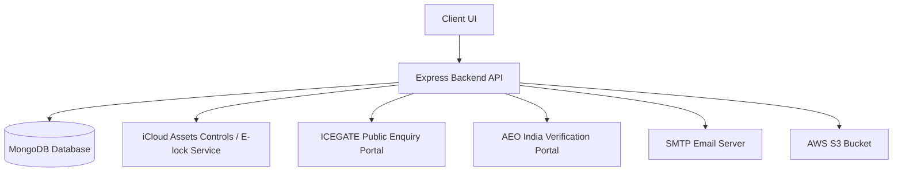
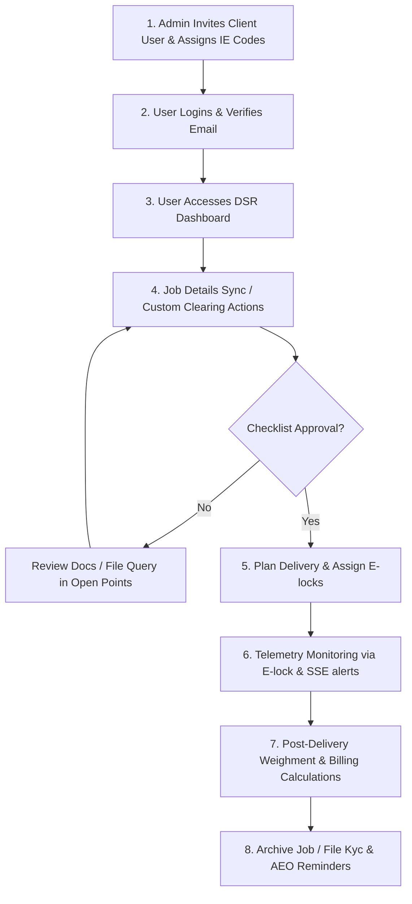
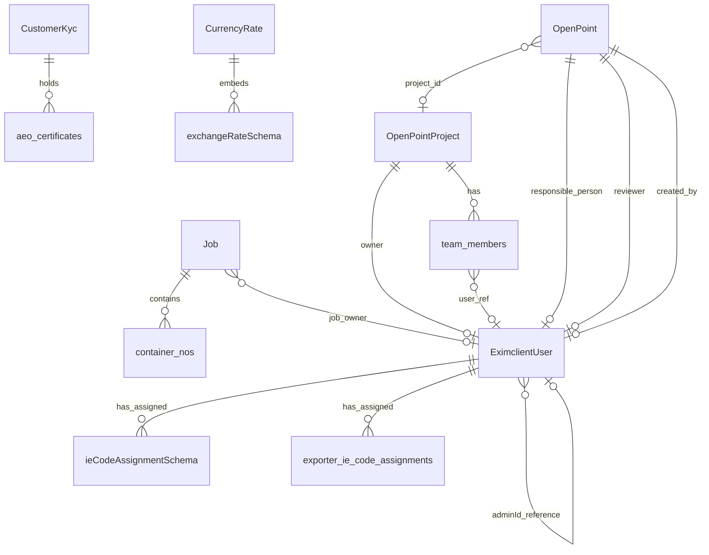

# EXIM Client Application - Knowledge Transfer & Developer Guide

Welcome to the **EXIM Client Application**. This document serves as a comprehensive Knowledge Transfer (KT) resource and reference guide for future developers onboarding to the codebase. It details the system architecture, database design, core business workflows, API integrations, math/calculations, edge cases, and deployment configurations.

---

## 1. Module Overview

The application is a logistics, compliance, and customs tracking platform for **Export-Import (EXIM)** operations. It is split into a React-based frontend (`client/`) and a Node.js/Express-based backend (`server/`).



The application is structured around several modules:
1. **User Dashboard & Column Management**: Provides customizable tables where users can toggle which data columns (such as detailed shipment status, timelines, or billing data) are displayed, as well as customize column ordering.
2. **Import Daily Status Report (Import DSR)**: Allows clients to monitor live Import shipments, checklists, documentation statuses, Customs Bills of Entry (BE), and delivery status.
3. **Export Daily Status Report (Export DSR)**: Tracks outgoing container progress, Customs Shipping Bills (SB), and clearance status.
4. **Transport & E-lock Tracking**: Tracks containers using Electronic Cargo Tracking System (ECTS) / E-locks. This module polls telemetry data (coordinates, battery, lock status) from external GPS trackers and maps container journeys.
5. **Billing / Net Weight Calculator**: Dynamically calculates shipping, customs duty, detention, CFS, transport, and labor expenses to estimate the total landing cost and cost per kilogram.
6. **AEO Verification**: Authorized Economic Operator (AEO) status management. It scrapes the AEO India site to verify company credentials and monitors validity periods.
7. **Open Points (Task Manager)**: A collaborative issue/task tracker specifically tailored for addressing cargo gaps, customs queries, action levels (L1–L5), and team assignments.

---

## 2. Core Application Workflows

The platform manages the lifecycle of cargo clearance, container delivery, and compliance. Below is the primary operational workflow:



### Key Workflow Details:
* **Ingestion & Assignment**: A SuperAdmin or Admin registers/invites users, assigning them specific Import Export Codes (IEC).
* **Clearance Tracking**: Users track the Bill of Entry (BE) status. The server proxies status queries directly to ICEGATE to bypass CORS.
* **Delivery Order (DO) & Examination Planning**: Staff plan container movement by road/rail, input revalidation logs, and capture container status updates.
* **Security & Telemetry**: During cargo transit, E-locks are assigned to containers. Live updates (location, locking status, tamper alerts) are pushed to the client using Server-Sent Events (SSE).
* **Weighment & Final Billing**: Upon container delivery, weighment slip images are uploaded. Net weight shortage/excess is calculated alongside logistics expenditures to produce a final cost-per-kg breakdown.

---

## 3. Business Rules & Access Controls

The platform enforces strict rules to isolate client data, define access scopes, and streamline collaborative tasks:

### Role Hierarchy
* **SuperAdmin**: Full control over global parameters, system configurations, superadmin dashboard metrics, and system-wide importer IE code listings.
* **Admin**: A customer administrator. Admins can invite team members (`users`) and manage detailed DSR column configurations, column orders, and access permissions for their clients.
* **User**: Standard clients or logistics personnel. Standard users can only view data, receive reminders, and update tasks for the specific IE Codes and Importers assigned to them by their Admin.

### Tab & Column Visibility
* Visibility of major tabs (e.g., `Jobs`, `Gandhidham`, `Transport`, `Accounts`, `AEO`) is customizable per-user from the Admin control panel.
* Individual database field visibilities are restricted based on `column-permissions` to hide sensitive financial fields (such as invoice values or custom duty) from low-clearance operations staff.

### Open Points Access
* Only project owners (`L4` / creator) or project team members (assigned roles `L1`, `L2`, `L3`) can view or update a project's tasks.
* Adding a user as a project member automatically assigns the `/open-points` module permission to their user profile.

---

## 4. API Integration Flow

The backend functions as an integration gateway connecting to multiple third-party systems:

| External System | Purpose | Target Endpoints / Protocol | Authentication |
| :--- | :--- | :--- | :--- |
| **iCloud Assets Controls** | Real-time E-lock assignments and GPS coordinates. | `http://icloud.assetscontrols.com:8092/OpenApi` | API Token (FTokenID & FUserGUID) |
| **Transport Microservice** | Relays notification events and container statuses. | `https://eximbot.alvision.in/transport/api` | Bearer token from `/login` using master service user |
| **ICEGATE Public Portal** | Resolves Bill of Entry (BE) status from Indian Customs. | `https://foservices.icegate.gov.in/enquiry/publicEnquiries/BETrack_Ices_action_Public` | Public Post Request (Proxied via backend) |
| **AEO India Portal** | Verifies Authorized Economic Operator certificate status. | `https://www.aeoindia.gov.in/certificatedetailview` | Cheerio scraping over HTTP Form payload |
| **AWS S3 Bucket** | Uploads & deletes compliance documents and images. | AWS S3 API (`@aws-sdk/client-s3`) | S3 Credentials (`REACT_APP_ACCESS_KEY` & region) |
| **SMTP Mail Server** | Sends registration codes and expiration reminders. | SMTP Protocol (SMTP server port `587`) | Username/Password credentials |

### Transport Authentication Flow
The backend uses `transportAuthService` to retrieve a Bearer token by posting credentials to the Transport API. Credentials are configurable via environment variables (`TRANSPORT_USERNAME` and `TRANSPORT_PASSWORD`) with local development defaults:
```
[EXIM Server] -- POST /login { username: "dev_master", password: "..." } --> [Transport API]
[EXIM Server] <-- Responds with exim_token -- [Transport API]
[EXIM Server] -- GET /notifications { Headers: Authorization: Bearer <exim_token> } --> [Transport API]
```

---

## 5. Database Models & Schema Relationships

The application uses MongoDB as its data store. Mongoose schemas are structured around the following models:



### Key Collections & Fields:

1. **`EximclientUser`** (`server/models/eximclientUserModel.js`)
   * `email`: String (unique lowercase)
   * `role`: String (`super_admin`, `admin`, `user`)
   * `adminId`: ObjectId (ref `EximclientUser`)
   * `ie_code_assignments`: Array of `{ ie_code_no, importer_name }` (Import DSR scope)
   * `exporter_ie_code_assignments`: Array of `{ ie_code_no, exporter_name }` (Export DSR scope)
   * `assignedModules`: Array of strings (`/open-points`, `/transport`, etc.)
   * `aeo_reminder_days`: Number (default: 90)
   * `aeo_reminder_enabled`: Boolean (default: true)

2. **`Job`** (`server/models/jobModel.js`)
   * `job_no`: String (unique index with `year`)
   * `year`: String (e.g., `25-26`)
   * `importer`: String
   * `ie_code_no`: String
   * `container_nos`: Array of container nested structures
     * `container_number`: String
     * `arrival_date`: String
     * `detention_from`: String
     * `do_validity_upto_container_level`: String
     * `container_rail_out_date`: String
     * `delivery_date`: String
   * `net_weight_calculator`: Object
     * `shipping`, `detention`, `cfs`, `transport`, `Labour`, `custom_clearance_charges`, `weight`: Strings
     * `total_cost`, `per_kg_cost`: Strings
     * `custom_fields`: Array of `{ id, name, value }`

3. **`CustomerKyc`** (`server/models/customerKycModel.js`)
   * `iec_no`: String (unique index)
   * `name_of_individual`: String (Company Name)
   * `aeo_certificates`: Array of `{ aeo_tier, certificate_no, certificate_issue_date, certificate_validity_date, certificate_present_validity_status }`
   * `status`: String (`verified`, `pending`, etc.)

4. **`OpenPointProject`** (`server/models/openPoints/openPointProjectModel.js`)
   * `name`: String
   * `initials`: String (uppercase unique initials, e.g., "MGP")
   * `owner`: ObjectId (ref `EximclientUser`)
   * `team_members`: Array of `{ user, role, department }`

5. **`OpenPoint`** (`server/models/openPoints/openPointModel.js`)
   * `project_id`: ObjectId (ref `OpenPointProject`)
   * `unique_id`: String (e.g., "MGP-12")
   * `title`, `description`, `gap_action`, `remarks`: Strings
   * `responsibility`: String (text name for Excel import matches)
   * `status`: String (`Green` [Closed], `Yellow`, `Red`, `Orange`)
   * `completion_date`: Date (set automatically when status turns Green)

6. **`CurrencyRate`** (`server/models/CurrencyRate.mjs`)
   * `notification_number`: String
   * `effective_date`: String
   * `exchange_rates`: Array of `{ currency_code, currency_name, import_rate, export_rate }`

---

## 6. Important Calculations & Validations

The platform performs automatic calculations and integrity validations to keep operations consistent:

### A. TEUs (Twenty-foot Equivalent Units)
Calculated dynamically in Mongoose aggregation pipelines (e.g., `analyticsController.js`):
$$\text{TEUs} = \sum \text{containers where size} = \begin{cases} 20'' \to 1 \\ 40'' \to 2 \\ \text{else} \to 0 \end{cases}$$

### B. Container Size Breakdown
Aggregates container sizes into a summary string:
$$\text{Breakdown} = \text{Count}(20\text{ft})\text{x}20 + \text{Count}(40\text{ft})\text{x}40$$
*(e.g., `2x20 + 3x40`)*

### C. Net Weight & Cost Calculator
Calculates the landed logistics expenses of a shipment.
#### 1. Total Cost Calculation:
$$\text{Total Cost} = \text{Duty} + \text{Shipping} + \text{Detention} + \text{CFS} + \text{Transport} + \text{Labour} + \text{Custom Clearance} + \text{Miscellaneous} + \sum \text{Custom Field Values}$$
#### 2. Cost Per Kilogram:
$$\text{Cost Per Kg} = \frac{\text{Total Cost}}{\text{Shipment Net Weight}}$$

> [!TIP]
> **Pre-Save Trigger Hook:** The `Job` model has a Mongoose pre-save hook (`jobModel.js`) that automatically updates the `net_weight_calculator.per_kg_cost` as `total_duty / job_net_weight` if both `total_duty` and `job_net_weight` are valid positive numerical fields.

### D. Operational Date Analytics
Calculates relative timings against target dates in the MongoDB aggregation pipeline:
$$\text{Days Until Event} = \frac{\text{EventDate} - \text{TodayDate}}{86,400,000}$$

This applies to four primary tracking metrics:
1. **Days until Arrival**: Classified as `ARRIVED` ($< 0$ days), `ARRIVING_TODAY` ($[0, 1)$ day), `ARRIVING_SOON_3_DAYS` ($[1, 4)$ days), or `PENDING_ARRIVAL`.
2. **Days until Rail Out**: Classified as `COMPLETED` ($< 0$ days), `SCHEDULED` ($\ge 0$ days), or `OVERDUE` (if container arrived but rail out is pending).
3. **Days until DO Expiry**: Classified as `EXPIRED` ($< 0$ days), `EXPIRES_TODAY` ($[0, 1)$ day), `EXPIRES_SOON_3_DAYS` ($[1, 4)$ days), or `VALID`.
4. **Days until Detention**: Classified as `ON_DETENTION` ($< 0$ days - charges accumulating), `STARTS_TODAY` ($[0, 1)$ day), `STARTS_SOON_3_DAYS` ($[1, 4)$ days), or `SAFE`.

### E. Validation: Import Export Code (IEC) Check
The utility `ieCodeValidator.js` validates assigned codes:
* The code must exist in the `CustomerKyc` database.
* The matching record must contain a valid `name_of_individual` (representing the registered importer name).

---

## 7. Edge Cases & Critical Warnings

When modifying or debugging the system, be aware of the following technical details:

> [!WARNING]
> **AEO Scraper Fragility**: 
> The AEO India lookup service relies on scraping HTML tables from `https://www.aeoindia.gov.in/certificatedetailview` using Cheerio selectors (`.tdCompanyDetailsLable` and `.tdCompanyDetailsdata`). If the AEO India portal updates its markup or CSS classes, this scraper will fail to retrieve values, throwing timeouts or parsing errors.

> [!IMPORTANT]
> **Local Memory Pagination (E-lock Assignments)**: 
> In `elockApiService.js` (line 165), the endpoint `getElockAssignments` requests all assignments from the transport API at once using a fixed limit of `10000`. Sorting, filtering, searching, and pagination are handled in-memory in Javascript. If the client dataset grows to tens of thousands of container logs, this will cause memory and performance issues.

---

## 8. Folder Structure

```
eximclientnew/
│
├── client/                     # React Frontend (Create React App structure)
│   ├── public/                 # Static assets, HTML shell
│   ├── src/
│   │   ├── components/         # Reusable UI elements
│   │   │   ├── Net weight/     # Landing Cost & per kg calculations components
│   │   │   ├── open-points/    # Task management views & modals
│   │   │   ├── Transport/      # E-lock and vehicle logs
│   │   │   └── SuperAdmin/     # Client-management interfaces
│   │   ├── pages/              # Main view screens (Dashboard, Login, DSR)
│   │   ├── services/           # Axios HTTP endpoints definitions (api.js)
│   │   ├── utils/              # Cookies and format utilities
│   │   ├── App.js              # Routing and layouts setup
│   │   └── index.js            # Entry point
│   ├── .env                    # Frontend environment parameters
│   └── package.json            # React dependencies
│
└── server/                     # Node.js Express Backend
    ├── config/                 # Mongoose DB and Env configuration loading
    ├── controllers/            # API Route handlers (business logic)
    ├── middlewares/            # Auth and role verification middlewares
    ├── models/                 # Mongoose schemas (Job, User, Kyc, OpenPoints)
    ├── routes/                 # Express route mappings
    ├── services/               # Background services (Scrapers, Reminders, E-lock)
    ├── utils/                  # Validation helpers (ieCodeValidator)
    ├── scripts/                # Database migration scripts
    ├── app.js                  # Express setup, CORS, and server boot entry
    ├── .env                    # Server-side secrets and URLs configuration
    ├── Dockerfile              # Containerization configuration
    └── package.json            # Backend Node packages
```

---

## 9. Configuration & Environment Variables

Create `.env` files in both the client and server root directories. Refer to the templates below:

### Server Configuration (`server/.env`)
```ini
# Environment Mode
NODE_ENV=production          # "development" or "production"
PORT=9003                    # Express server port

# MongoDB URIs
DEV_MONGODB_URI=mongodb://localhost:27017/exim
PROD_MONGODB_URI=mongodb://<user>:<password>@<cluster-address>/exim?ssl=true
Gandhidham_URI=mongodb://localhost:27017/exim

# JWT Secrets
JWT_ACCESS_SECRET=your_jwt_access_secret_key_here
JWT_REFRESH_SECRET=your_jwt_refresh_secret_key_here
JWT_SECRET=your_jwt_secret_key_here
EXIM_API_KEY=your_exim_api_key_here

# Third-Party Microservice URLs
EXPORT_API_BASE_URL=https://eximbot.alvision.in/export/api
IMPORT_API_BASE_URL=https://eximbot.alvision.in/import/api
ELOCK_API_BASE_URL=http://icloud.assetscontrols.com:8092/OpenApi
LOCAL_API_BASE_URL=http://3.108.244.38:9005/api

# AWS S3 Storage Config
REACT_APP_S3_BUCKET=exim-images-p1
REACT_APP_ACCESS_KEY=your_aws_access_key
REACT_APP_SECRET_ACCESS_KEY=your_aws_secret_access_key
REACT_APP_AWS_REGION=ap-south-1

# SMTP E-mail Settings
MAIL_SERVER=smtp-mail.outlook.com
MAIL_PORT=587
MAIL_USERNAME=connect@yourdomain.in
MAIL_PASSWORD=your_smtp_app_password
MAIL_FROM=connect@yourdomain.in
MAIL_FROM_NAME="EXIM Services India Ltd."

# E-lock / MQTT Integration
MQTT_BROKER_URL=mqtt://mqtt.assetscontrols.com:1883
MQTT_USER=alluvium
MQTT_PASSWORD=your_mqtt_password
```

### Client Configuration (`client/.env`)
```ini
# API endpoint base path
REACT_APP_API_STRING=http://localhost:9003/api

# Local Port for React dev server
PORT=3001
REACT_APP_VERSION="01.07.03"
```

---

## 10. Troubleshooting Tips

### 1. AEO Certificate Auto-Verification Fails
* **Symptom**: Verifications return `Directory lookup failed` or timeout.
* **Reason**: The scraper is blocked by the AEO India firewall or the portal's layout changed. (Note: The backend first performs a local lookup via the implemented `searchAeodirectory` method to fetch any existing certificates).
* **Resolution**: Check the server logs. If it is a selector issue, update `parseAeoindiaResponse` in `aeoIntegrationService.js` to match the portal's updated labels.

### 2. Live Notifications Disconnect / Standstill
* **Symptom**: Notifications under `/api/notifications/stream` stop reporting.
* **Reason**: The Server-Sent Events (SSE) stream disconnected or the transport service token expired.
* **Resolution**: The client-side listener should implement automatic reconnect logic. Verify the environment variables `TRANSPORT_USERNAME` and `TRANSPORT_PASSWORD` in `server/.env` if authentication fails.

### 3. Expiration Reminders Are Not Sent
* **Symptom**: Document validity limits pass without email reminders.
* **Reason**: SMTP credentials are misconfigured, or the Node server is stopped. The scheduler runs automatically on server start.
* **Resolution**: Verify SMTP configuration parameters (`MAIL_USERNAME` and `MAIL_PASSWORD`) in `server/.env` and ensure the backend process is running.

---

## 11. Recommended Future Improvements

To improve the platform's stability, the following enhancements are suggested:

1. **Server-Side Pagination for E-locks**: Modify `getElockAssignments` in `elockApiService.js` to pass `page` and `limit` directly to the transport/others APIs instead of buffering 10,000 records in Node memory.
2. **Decouple Scrapers**: Move Cheerio AEO scraping to an isolated worker thread or replace it with a headless browser API (such as Playwright) with OCR to bypass browser fingerprinting checks.
3. **Caching Layer for ICEGATE**: Add Redis caching for `/api/be-details` to cache Bill of Entry details for at least 15 minutes, preventing rate limiting from the ICEGATE public server.
