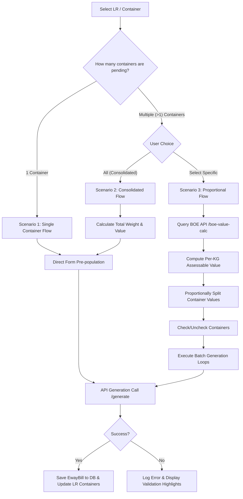

# EximTransport — E-Way Bill Integration Module

Welcome to the **E-Way Bill Module** documentation. This module handles the end-to-end generation, verification, and lifecycle management of Indian E-Way Bills directly from Lorry Receipt (LR/PR) data. It integrates with the **Masters India** API (a Government-approved GST Suvidha Provider - GSP) to ensure compliance with the National Informatics Centre (NIC) and Goods and Services Tax (GST) regulations of India.

This document serves as a complete **Knowledge Transfer (KT) resource** for future developers to understand the module's architecture, workflows, business logic, and database schemas.

---

## 1. Module Overview

The E-Way Bill (EWB) module replaces manual entry on government portals by automatically transforming EximERP data into compliant E-Way Bills. It covers:
*   **Generation**: Direct E-Way Bill generation using LR/PR container data.
*   **Multi-Container Scenarios**: Automated handling of single-container shipments, consolidated multi-container shipments, or proportional value splits for multi-vehicle distributions.
*   **Lifecycle Actions**: Updating vehicle details (Part-B updates), updating transporters, extending validity period (when delayed), rejecting, and cancelling EWBs.
*   **Real-time Synchronization**: Pulling official E-Way Bill status changes directly from the government registry back to the local database.
*   **Error Auditing**: Detailed logging of all API payloads and validation failures for operational transparency.

---

## 2. System Architecture & Folder Structure

The module follows a classic React-Express-Mongoose architecture, using the **Masters India API** as the GSP gateway.

### Frontend Components (`client/src/components/ewaybill/`)
*   [`EwayBillDashboard.js`](file:///c:/Users/india/Desktop/Projects/eximtransport/client/src/components/ewaybill/EwayBillDashboard.js): Main workspace containing action tables, status statistics, and filter controls.
*   [`EwayBillGenerate.js`](file:///c:/Users/india/Desktop/Projects/eximtransport/client/src/components/ewaybill/EwayBillGenerate.js): Core wizard form (3-step stepper) that enables reviews and overrides before E-Way Bill generation.
*   [`EwayBillGenerateLR.js`](file:///c:/Users/india/Desktop/Projects/eximtransport/client/src/components/ewaybill/EwayBillGenerateLR.js): Handles batch-selected and single-selected generation flows for LRs.
*   [`EwayBillBulkOperations.js`](file:///c:/Users/india/Desktop/Projects/eximtransport/client/src/components/ewaybill/EwayBillBulkOperations.js): Future-ready framework for bulk generation operations.
*   [`ewbValidationHelpers.js`](file:///c:/Users/india/Desktop/Projects/eximtransport/client/src/components/ewaybill/ewbValidationHelpers.js): Frontend validation checks matching NIC constraints.
*   **`Dashboard/`**
    *   [`MetricCards.jsx`](file:///c:/Users/india/Desktop/Projects/eximtransport/client/src/components/ewaybill/Dashboard/MetricCards.jsx): Visual cards showing Active, Expired, Cancelled, and Pending counts.
    *   [`PendingLRsTab.jsx`](file:///c:/Users/india/Desktop/Projects/eximtransport/client/src/components/ewaybill/Dashboard/PendingLRsTab.jsx): Table of containers/LRs awaiting EWB generation.
    *   [`TabNavigation.jsx`](file:///c:/Users/india/Desktop/Projects/eximtransport/client/src/components/ewaybill/Dashboard/TabNavigation.jsx): Manages routing between pending and generated lists.
*   **`Modals/`**
    *   [`LrEwayBillDialog.jsx`](file:///c:/Users/india/Desktop/Projects/eximtransport/client/src/components/ewaybill/Modals/LrEwayBillDialog.jsx): Manages container selection, Bill of Entry (BOE) value extraction, and scenario selection.
    *   [`EWBGenerationModal.jsx`](file:///c:/Users/india/Desktop/Projects/eximtransport/client/src/components/ewaybill/Modals/EWBGenerationModal.jsx): Wraps the generator form inside a popup.
    *   [`EwayBillActionModal.jsx`](file:///c:/Users/india/Desktop/Projects/eximtransport/client/src/components/ewaybill/Modals/EwayBillActionModal.jsx): Handles Part-B updates, validity extensions, transporter changes, and cancellations.
    *   [`EwayBillMultiContainerDialog.jsx`](file:///c:/Users/india/Desktop/Projects/eximtransport/client/src/components/ewaybill/Modals/EwayBillMultiContainerDialog.jsx): Selection dialog for consolidated containers.
    *   [`PartAPreview.jsx`](file:///c:/Users/india/Desktop/Projects/eximtransport/client/src/components/ewaybill/Modals/PartAPreview.jsx): Renders a preview of Part-A slip details.

### Backend Files (`server/`)
*   [`server/routes/ewaybill/ewayBillRoutes.mjs`](file:///c:/Users/india/Desktop/Projects/eximtransport/server/routes/ewaybill/ewayBillRoutes.mjs): Express routes mapping web requests to API services and proxies.
*   [`server/services/ewayBillService.mjs`](file:///c:/Users/india/Desktop/Projects/eximtransport/server/services/ewayBillService.mjs): Intermediary class handling token auth caching, payload transformations, and external GSP calls.
*   [`server/services/ewbValidationService.mjs`](file:///c:/Users/india/Desktop/Projects/eximtransport/server/services/ewbValidationService.mjs): Modular validation service executing business rules, state rules, and format compliance checks.
*   [`server/model/srcc/EwayBill.mjs`](file:///c:/Users/india/Desktop/Projects/eximtransport/server/model/srcc/EwayBill.mjs): Mongoose database schema storing final generation values and action history.
*   [`server/model/srcc/Ewaybillerrorlog.mjs`](file:///c:/Users/india/Desktop/Projects/eximtransport/server/model/srcc/Ewaybillerrorlog.mjs): MongoDB schema archiving failed requests and official error codes.

---

## 3. Complete Workflows

The module supports three major generation scenarios, alongside lifecycle updates:



### Scenario 1: Single Container Flow (Auto-Select)
1. Triggered when the selected LR has exactly **one** pending container.
2. The UI automatically bypasses container selection screen.
3. Form fields are pre-populated with LR and container properties.
4. User submits the form $\rightarrow$ system issues a single `POST /generate` API call.
5. A single EWB is generated, saved in MongoDB, and the container record is updated with `eWay_bill`.

### Scenario 2: Consolidated Multi-Container Flow
1. Selected when the LR has multiple containers and the user clicks **"All Containers"**.
2. Combines all containers into a single E-Way Bill registration.
3. Form values are pre-populated:
    *   `totalWeight` = Sum of all selected container gross weights.
    *   `totalInvoiceValue` = The entire Bill of Entry (BOE) total value (not split).
4. User submits the form $\rightarrow$ system issues a single `POST /generate` API call.
5. Saves **one** EWB document linked to `containerIds` (array of container strings), and marks all containers in LR with the same `eWay_bill`.

### Scenario 3: Proportional Multi-Container Flow
1. Selected when the LR has multiple containers and the user clicks **"Select Specific"**.
2. Requires a Bill of Entry (BOE/BE) number and date.
3. The system calls `GET /eway-bill/boe-value-calc`.
4. It fetches BOE details from an external parsing API, extracts values, and computes a **Per-KG Value**:
    $$\text{Total Value} = \text{Assessable Value} + \text{BCD} + \text{SWS}$$
    $$\text{Per-KG Value} = \frac{\text{Total Value}}{\text{BOE Gross Weight}}$$
5. The system displays a breakdown table showing each container's proportional assessable value:
    $$\text{Container Assessable Value} = \text{Per-KG Value} \times \text{Container Gross Weight}$$
6. The user selects which containers to generate EWBs for.
7. Upon submission, the frontend calls `submitMultipleEwayBills()` which runs a sequential loop:
    *   Calculates proportional values and taxes for the container.
    *   Calls `POST /generate` per container.
    *   Aggregates results and shows a summary modal indicating successful and failed container generations.
8. Multiple distinct E-Way Bills are saved in the DB, each referencing a single container.

### Part-B Vehicle Updates (Vehicle Changes)
1. Used when a vehicle breaks down or cargo undergoes transshipment.
2. Form collects: New Vehicle Number, Vehicle Type (Regular/ODC), Place of Change, State of Change, and Reason (breakdown, transshipment, first-time, etc.).
3. Calls `POST /eway-bill/update-vehicle` $\rightarrow$ forwards to Masters India.
4. If successful, updates the primary `vehicleNumber` and appends an audit object to the `vehicleUpdateHistory` array.

### Validity Extensions
2. Valid E-Way Bills have a set time limit based on distance. If delayed, they can be extended within **8 hours before or after the expiry time**.
3. Form collects: Current Pincode, Current Place, Current State, Remaining Distance, Consignment Status (`M` = In Movement, `T` = In Transit/Warehouse), Transit Type (required if `T` $\rightarrow$ `R`=Road, `W`=Warehouse, `O`=Others), and Extension Reason.
4. Calls `POST /eway-bill/extend-validity`.
5. Updates `validUpto` and appends an audit block to `extensionHistory`.

### Cancellations & Rejections
*   **Cancellation**: Allowed within **24 hours** of EWB generation. Reverts state on the portal. Calls `POST /eway-bill/cancel`, updates `ewbStatus = "Cancelled"`.
*   **Rejection**: Allowed within **72 hours** of EWB generation (used if generated by another party on your GSTIN). Calls `POST /eway-bill/reject`, updates `ewbStatus = "Rejected"`.

---

## 4. Business Rules & Data Overrides

To prevent NIC validation rejections, the module implements several automated overrides and strict logic gates:

### The "Suraj" Consignor Override
*   **Rule**: If the Consignor name contains the string `"suraj"` (case-insensitive), it represents a specific unregistered cargo handler/consignor pattern.
*   **Action**: The system automatically forces the Consignor GSTIN to `"URP"` (Unregistered Person) and overrides the Consignor Pincode to `"999999"`.

### Unregistered Persons (URP) Pincode Defaults
*   **Rule**: Unregistered entities cannot have standard pincodes in test or non-production environments to bypass state checks.
*   **Action**: Any entity with GSTIN `"URP"` is automatically assigned pincode `999999`.

### Tax Code Normalization Rules
To comply with Indian tax regulations, the system enforces correct GST tax types:
1.  **Inter-State Transaction** ($\text{From State Code} \neq \text{To State Code}$):
    *   Must only charge **IGST**.
    *   If CGST or SGST are provided, the system overrides them:
        $$\text{IGST} = \text{CGST} + \text{SGST}$$
        $$\text{CGST} = \text{SGST} = 0$$
2.  **Intra-State Transaction** ($\text{From State Code} = \text{To State Code}$):
    *   Must charge **CGST + SGST** split equally (unless it is an Import sub-supply).
    *   If IGST is provided, the system overrides it:
        $$\text{CGST} = \text{SGST} = \frac{\text{IGST}}{2}$$
        $$\text{IGST} = 0$$

### SEZ (Special Economic Zone) Auto-Correction
*   **Rule**: SEZ units are exempt from standard state GST rules. A GSTIN's **6th character (index 5)** being `'Z'` denotes an SEZ registration.
*   **Action**: The system forces the `state_of_consignor` (or consignee) to `"Other Country"` (Code 99) in compliance with NIC rules for SEZ units.

### Transaction Type Automation
*   **Rule**: The standard transaction type is "Regular". However, if places mismatch, it must transition.
*   **Action**:
    *   If `consigneeState` differs from the actual `shipToState`, the type is auto-promoted to **"Bill To - Ship To"** (Type 2).
    *   If `consignorState` differs from the actual `dispatchFromState`, the type is auto-promoted to **"Bill From - Dispatch From"** (Type 3).

### Duplicate Invoice Blocks
*   **Rule**: NIC does not allow duplicate E-Way Bills for the same invoice.
*   **Action**: Prior to calling the API, the system checks MongoDB for any EWB with the same `documentNumber` + `documentType` + `consignorGstin` whose status is **not** `"Cancelled"` or `"Rejected"`. If found, the generation is blocked locally to save API requests.

---

## 5. API Integration Flow & Proxies

### Authentication Token Caching
The service connects to Masters India. Rather than authenticating on every request, the backend implements JWT caching:
*   Authenticates via `/token-auth/`.
*   Saves the token and computes a expiration timestamp exactly **23 hours** in the future.
*   Subsequent requests reuse the token unless the cached date has passed, at which point it silently refreshes.

### Local Backend API Gateway Mappings

| Local Express Route (GET/POST) | Masters India API Path | NIC Action Code / Payload Field |
| :--- | :--- | :--- |
| `POST /api/eway-bill/token-auth` | `/token-auth/` | Fetch Access JWT Token |
| `POST /api/eway-bill/generate` | `/ewayBillsGenerate/` | Generate E-Way Bill (Part A & B) |
| `POST /api/eway-bill/cancel` | `/ewayBillCancel/` | Cancel E-Way Bill |
| `POST /api/eway-bill/update-vehicle` | `/updateVehicleNumber/` | Update Vehicle (Part B) |
| `POST /api/eway-bill/extend-validity` | `/ewayBillValidityExtend/` | Extend validity period |
| `POST /api/eway-bill/reject` | `/ewayBillReject/` | Reject E-Way Bill |
| `POST /api/eway-bill/update-transporter` | `/transporterIdUpdate/` | Update Transporter ID |
| `GET /api/eway-bill/distance` | `/distance/` | Get distance between PIN codes |
| `GET /api/eway-bill/details/:ewbNo` | `/getEwayBillData/` | Action: `GetEwayBill` |

### External API Proxies
The backend proxies requests to external services to avoid CORS issues in browsers and simplify file handling:
1.  **BOE Extract Proxy (`GET /api/eway-bill/boe-extract`)**: Fetches structured BOE/Manifest details from the external OCR parser (`http://3.108.244.38:8002/api/v1/extract-job`).
2.  **BOE Upload Proxy (`POST /api/eway-bill/boe-upload`)**: Accepts a BOE PDF file via Multer, formats it as a `multipart/form-data` payload using `FormData`, and proxies it to the parser's `/upload` endpoint.

---

## 6. Database Models & Relationships

The E-Way Bill data structure is mapped in MongoDB. Below are the key schemas:

### `EwayBill` Schema (excerpts from [`EwayBill.mjs`](file:///c:/Users/india/Desktop/Projects/eximtransport/server/model/srcc/EwayBill.mjs))
```javascript
{
  lr: { type: mongoose.Schema.Types.ObjectId, ref: "PrData" }, // Link to Lorry Receipt / Purchase Requisition
  containerId: { type: String }, // Single container reference (Scenario 1, 3)
  containerIds: [{ type: String }], // Multi-container references (Scenario 2)

  ewbNo: { type: String, unique: true, sparse: true },
  ewbStatus: { type: String, enum: ["Pending", "Generated", "Cancelled", "Expired", "Rejected"] },
  validUpto: { type: String },
  pdfUrl: { type: String },

  userGstin: { type: String },
  supplyType: { type: String }, // inward / outward
  subSupplyType: { type: String }, // Supply, Import, Export, etc.
  documentNumber: { type: String },
  documentDate: { type: String },

  consignorGstin: { type: String },
  consignorName: { type: String },
  consignorPincode: { type: Number },
  consigneeGstin: { type: String },
  consigneeName: { type: String },
  consigneePincode: { type: Number },

  itemList: [{
    productName: String,
    hsnCode: String,
    quantity: Number,
    qtyUnit: String,
    taxableAmount: Number,
    cgstRate: Number,
    sgstRate: Number,
    igstRate: Number
  }],

  totalInvoiceValue: { type: Number },
  taxableAmount: { type: Number },
  igstAmount: { type: Number },
  cgstAmount: { type: Number },
  sgstAmount: { type: Number },

  // Tracking Action History
  vehicleUpdateHistory: [{
    updatedAt: { type: Date, default: Date.now },
    updatedBy: { type: mongoose.Schema.Types.ObjectId, ref: "User" },
    oldVehicle: String,
    newVehicle: String,
    reasonCode: String,
    reasonText: String,
    fromPlace: String,
    fromState: String
  }],

  extensionHistory: [{
    extendedAt: { type: Date, default: Date.now },
    extendedBy: { type: mongoose.Schema.Types.ObjectId, ref: "User" },
    previousValidUpto: String,
    newValidUpto: String,
    remainingDistance: Number,
    currentPlace: String,
    currentPincode: Number,
    remarks: String
  }]
}
```

### Relationship with `PrData` (LR/PR Model)
The ERP handles containers within a PR. 
*   **EwayBill $\rightarrow$ PR**: Linked via the `lr` reference field.
*   **PR $\rightarrow$ EwayBill**: The `PrData` schema holds a nested `containers` array. When an E-Way Bill generates successfully, the container's `eWay_bill` string field is populated with the generated `ewbNo`:
    ```javascript
    // Update container record on successful generation
    await PrData.updateOne(
      { _id: lrId, "containers._id": containerId },
      { $set: { "containers.$.eWay_bill": result.ewayBillNo } }
    );
    ```

---

## 7. Important Calculations & Validations

### Proportional Assessable Value Calculation (Scenario 3)
When cargo is split across multiple containers, we must calculate the exact taxable value proportional to each container's weight.
1.  **Extract Totals from BOE**:
    $$\text{Total Invoice Value (Value } Y) = \text{Assessable Value} + \text{Basic Customs Duty (BCD)} + \text{Social Welfare Surcharge (SWS)}$$
2.  **Determine Price-per-Weight Factor**:
    $$\text{Per-KG Value} = \frac{\text{Total Invoice Value}}{\text{BOE Gross Weight}}$$
3.  **Proportionally Calculate Container Value**:
    $$\text{Container Assessable Value} = \text{Per-KG Value} \times \text{Container Gross Weight}$$
4.  **Taxes (IGST) Calculation**:
    $$\text{Container IGST Amount} = \text{Container Assessable Value} \times \left(\frac{\text{IGST Rate}}{100}\right)$$
5.  **Final Container Invoice Value**:
    $$\text{Total Container Invoice Value} = \text{Container Assessable Value} + \text{Container IGST Amount}$$

### Manual Distance Overrides
*   **Rule**: The distance calculated by PIN-to-PIN lookup is the standard. If users manually change the distance:
    *   The manual distance must stay within **$\pm10\%$** of the official API distance.
    *   *Exception*: If the sub-supply type is "Import" or "Export", this validation is skipped (as transport might only cover the inland leg).

### Temporary Vehicle Formats
*   Temporary registrations must begin with `"TM"` followed by exactly 6 alphanumeric characters.
    *   *Regex*: `/^TM[A-Z0-9]{6}$/`
    *   *Example*: `TM123456`, `TMAB12CD`.

### Railway Document Validation
*   For Rail (Mode 2), the transporter document must match:
    *   **PMS Format**: `P` followed by 2-7 letter station code, followed by digit PWB number (e.g., `PNDLS12345`).
    *   **FOIS Format**: `F` followed by 2-7 letter station code, followed by digit RR number (e.g., `FNDLS12345`).

---

## 8. Sandbox Environment Overrides

In Development or Testing environments (`EWAY_BILL_ENV = "development" | "testing"`), the Masters India Sandbox environment restricts requests to specific dummy GSTINs to prevent errors:

*   **Sandbox Consignor GSTIN**: `24ANGPR7652E1ZV` (Gujarat)
*   **Sandbox Consignee GSTIN**: `05AAABC0181E1ZE` (Uttarakhand)

To ensure smooth testing without rejecting real business inputs:
1.  If the environment is sandbox, the system overrides Consignor and Consignee values:
    *   If inward supply (Import) $\rightarrow$ Consignor = `"URP"`, Consignee = Sandbox Consignee.
    *   If outward supply (Export) $\rightarrow$ Consignor = Sandbox Consignor, Consignee = `"URP"`.
    *   If domestic supply $\rightarrow$ Consignor = Sandbox Consignor, Consignee = Sandbox Consignee.
2.  State names and pincodes are adjusted dynamically in the sandbox payload to match Uttarakhand (`05` / `248001`) and Gujarat (`24` / `380001`) to prevent location mismatch errors from the NIC API.

---

## 9. Troubleshooting & Error Codes

NIC API errors are intercepted, parsed, and mapped directly to user-facing form fields for quick resolution:

### NIC Error Codes Mapping Table

| NIC Error Code | Associated Form Field | Resolution Advice |
| :--- | :--- | :--- |
| **216** | `hsnCode` | The HSN code is invalid. Check the GSTR master list. |
| **219** | `cgstRate` / `sgstRate` | CGST/SGST rates are invalid. Ensure standard rates (e.g., 0%, 5%, 9%, 14%). |
| **220** | `transportationMode` | Mode is invalid. Select 1=Road, 2=Rail, 3=Air, 4=Ship. |
| **222** | `transporterId` | The transporter GSTIN is invalid. |
| **224** | `transporterDocDate` | Date cannot be in the future or earlier than invoice date. |
| **301** | `ewayBillNo` | The E-Way Bill number is invalid, expired, or cancelled. |
| **312** | `ewayBillNo` | EWB was not generated by your GSTIN or is already cancelled. |
| **357** | `ewayBillNo` | Government API timeout; retry the sync status button. |
| **362** | `transporterDocDate` | Date mismatch; transporter document date must be $\ge$ invoice date. |
| **366** | `generatedDate` | Cannot sync today's bills in bulk. Perform a single EWB lookup. |
| **406** | `groupNumber` | Multi-vehicle movement requires a valid group number. |
| **418** | General | No matching record found. |
| **436** | `consignorPincode` | PIN code does not belong to the Consignor State. |
| **437** | `consignorState` | State code does not match the Consignor Pincode. |
| **611** | `documentType` | Document type (e.g., Invoice vs Challan) is invalid for the selected supply type. |
| **616** | `shipToGstin` | Rejection occurred because `ship_to_gstin` was sent for a "Regular" transaction. (Excluded automatically by the system). |
| **624** | `igstRate` | Tax mismatch. Intra-state must charge CGST+SGST; Inter-state must charge IGST. |
| **702** | `transportDistance` | Distance is too high. Max allowed is 4000 km. |

### API Diagnostics
All errors, request payloads, and stack traces are captured in the `EwayBillErrorLog` collection. In case of issues:
1.  Check the API response payload in the Mongo logs (`serverlogs` or `ewaybillerrorlogs` collection).
2.  Extract the `nic_code` and check against the EWB User Manual.

---

## 10. Future Improvements

Developers working on future versions of this module should consider the following roadmaps:
1.  **Automated Webhooks / Cron Sync**: Set up a daily cron task (via Bull Queue or Node-Schedule) to sync active E-Way Bills and update their statuses to `"Expired"` or `"Cancelled"` when validity periods elapse.
2.  **Bulk E-Way Bill Generation (APIs #25, #25A, #26)**: Implement batch payload compiling to allow generation of up to 50 E-Way Bills in a single API roundtrip.
3.  **PDF Local Caching**: Download generated EWB PDFs from Masters India and cache them in our AWS S3 bucket (`exim-images-p1`) to reduce API calls and speed up document retrieval.
4.  **Multi-Vehicle Group Modifications**: Build user interfaces for updating or deleting specific vehicles from an initiated multi-vehicle group (API #10B).
