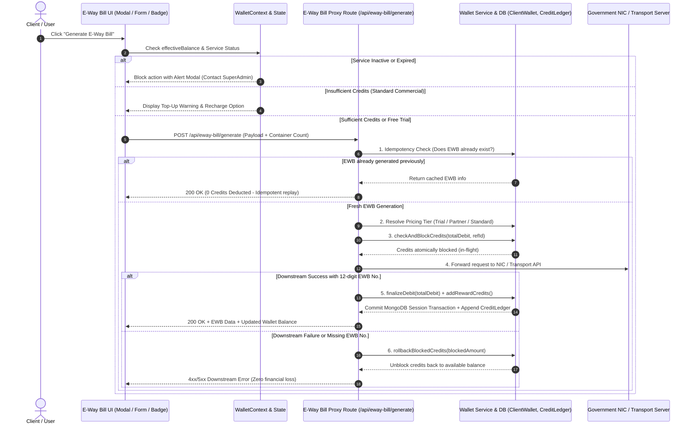

# E-Way Bill Credit Wallet & Billing System Feature Documentation
**Commit Ref:** `1af6b4e` (`1af6b4e2b968c3f294f3a007d9b745950d42a1f0`)  
**Commit Message:** `feat: add e-way bill credit wallet and billing system with ledger tracking and admin management`  
**Author:** Atul Nagose  
**Repository:** `eximclientnew`  
**Date:** September 2026  

---

## 1. Executive Summary & Purpose

The **E-Way Bill Credit Wallet & Billing System** is an enterprise-grade SaaS billing and credit lifecycle management module built directly into the EXIM platform. It transitions E-Way Bill generation into a metered, secure, pay-per-use service with zero financial discrepancy.

### Key Value Delivered:
1. **Commercial SaaS Monetization:** 1 Credit = ₹9 INR per container / generation, with multiplier support for multi-container and combined consignments.
2. **Promotional Free Trial System:** New clients receive an automatic **3 Months Free Service (90 days)** upon first-time SuperAdmin activation.
3. **Partner Incentive Program:** Special commercial tier for **SFPL + SRCC Partner** consignments (0 credits debited, +1 reward credit awarded).
4. **Financial Consistency & Zero Leakage:** Strict **Two-Phase Locking (Check & Block -> Execute Downstream -> Finalize or Rollback)** ensures credits are never debited on failed or unverified generations.
5. **Centralized SuperAdmin Controls:** Role-based access for SuperAdmins (`superadmin@exim.com`) to activate/deactivate accounts, allocate credits, extend validities, and inspect immutable audit ledgers.

---

## 2. Architecture & Core Workflow

---

## 3. Database Schema & Data Models

### 3.1 `ClientWallet` ([ClientWallet.js](file:///c:/project/eximclientnew/server/models/ClientWallet.js))
Represents the tenant balance, service lifecycle state, and audit trails.

| Field | Type | Default | Description |
|---|---|---|---|
| `clientId` | `ObjectId` (Ref: `EximclientUser`) | Required | Unique client user association with primary index |
| `availableCredits` | `Number` | `0` | Total unencumbered credit balance (`min: 0`) |
| `blockedCredits` | `Number` | `0` | In-flight credits currently reserved during generation |
| `walletServiceStatus` | `String` (`ACTIVE` / `INACTIVE`) | `"INACTIVE"` | Service activation gatekeeper |
| `isFirstTimeActivated`| `Boolean` | `false` | True once SuperAdmin has activated the service at least once |
| `firstActivatedAt` | `Date` | `null` | Timestamp of initial activation |
| `activationDate` | `Date` | `Date.now` | Date account was initialized |
| `validUntil` | `Date` | `Date.now + 90 Days` | Service expiration timestamp |
| `serviceStatusHistory`| `Array<SubDocument>` | `[]` | Immutable audit log of all status transitions (`ACTIVE`/`INACTIVE`, `changedBy`, `remarks`, `validUntil`) |
| `partnerTierHistory` | `Array<SubDocument>` | `[]` | Immutable audit log of partner status changes (`isSfplClient`, `changedBy`, `remarks`) |

#### Virtual Getters:
- `effectiveBalance`: `Math.max(0, availableCredits - blockedCredits)` (Spendable credits)
- `isExpired`: `Date.now() > validUntil`
- `daysRemaining`: `Math.ceil((validUntil - now) / 86400000)`

---

### 3.2 `CreditLedger` ([CreditLedger.js](file:///c:/project/eximclientnew/server/models/CreditLedger.js))
Immutable append-only double-entry financial ledger. Every balance change in `ClientWallet` is audited here.

| Transaction Type | Credits Sign | Business Trigger |
|---|---|---|
| `PAYMENT_CREDIT` | `+` (Positive) | Approved payment request / online top-up |
| `EWAYBILL_DEBIT` | `-` (Negative) | Successfully generated commercial E-Way Bill |
| `EWAYBILL_REWARD` | `+` (Positive) | Incentive credit awarded for SFPL + SRCC consignments |
| `ADMIN_ADJUSTMENT` | `+` or `-` | Manual credit allocation or correction by SuperAdmin |
| `REVERSAL` | `+` (Positive) | System refund or cancelled invoice reversal |
| `EWAYBILL_TRIAL_FREE` | `0` (Zero) | Free EWB generated during 3-Month Free Trial (full audit trail) |

---

## 4. Backend Billing & Proxy Engine

### 4.1 Universal 12-Digit EWB Extractor (`extractEwbNumber`)
Government NIC portals, Masters India, and third-party transport servers return E-Way Bill numbers in diverse, inconsistent JSON structures or error messages.
- **Deep JSON Traversal:** Searches keys: `ewbNo`, `ewayBillNo`, `ewbNumber`, `ewayBillNumber`, `generatedEwbNo`, `eway_bill_no`, `ewb_no` across nested payloads (`responseData`, `result`, `itemList`, `response`, etc.).
- **String & Error Text Parsing:** Regex extraction (`/\b\d{12}\b/`) detects E-Way bill numbers in duplicate responses (e.g., *"E-Way Bill already generated: 371010885063"*).

### 4.2 Dynamic Pricing & Multiplier Engine
Implemented in [walletService.js](file:///c:/project/eximclientnew/server/services/walletService.js):

1. **SFPL + SRCC Partner Incentive:**
   - **Condition:** Client is SFPL (`isSfplClient === true`, branch `AMD`, or `AMD/` job) **AND** transporter includes `SRCC` / `SR CONTAINER CARRIERS`.
   - **Cost:** **0 Debit**, **+1 Reward Credit**.
2. **3 Months Free Trial:**
   - **Condition:** `walletServiceStatus === "ACTIVE"`, `isFirstTimeActivated === true`, `now <= validUntil`.
   - **Cost:** **0 Debit**, **0 Reward** (`EWAYBILL_TRIAL_FREE` recorded in ledger).
3. **Standard Commercial Tier:**
   - **Condition:** Default SaaS commercial usage.
   - **Cost:** **1 Credit (₹9) per container**.
   - Multi-container count resolved via `extractContainerCount()`: Supports single containers, array selections, and combined consignments.

### 4.3 Idempotency & Duplicate Protection
If a user re-submits a job or container that already has an active, valid E-Way Bill number in the database:
- Returns HTTP 200 with existing EWB details.
- Flags `alreadyGenerated: true` and `idempotentReplay: true`.
- Deducts **0 credits**, preventing duplicate billing.

### 4.4 Two-Phase Reservation & Transaction Rollback
- **Step 1:** Atomic check & increment of `blockedCredits` in MongoDB.
- **Step 2:** Downstream HTTP proxy execution with a 60-second resilient timeout.
- **Step 3 (Success):** MongoDB Session transaction deducts `availableCredits` & `blockedCredits`, records `CreditLedger` entry, and awards any incentive credits.
- **Step 4 (Failure / Exception / Timeout):** `rollbackBlockedCredits()` decrements `blockedCredits` with a detailed audit remark.

---

## 5. SuperAdmin & Administration Management

### 5.1 New Dedicated Routes ([adminRoutes.js](file:///c:/project/eximclientnew/server/routes/adminRoutes.js) & [ewayBillProxyRoutes.js](file:///c:/project/eximclientnew/server/routes/ewayBillProxyRoutes.js))

| Route | Method | Access | Description |
|---|---|---|---|
| `/api/admin/wallet/clients` | `GET` | SuperAdmin | Searchable list of all clients with live balances and credit states |
| `/api/admin/wallet/client-details/:id` | `GET` | SuperAdmin | Full wallet status, 20 recent transactions, validity, and stats |
| `/api/admin/wallet/manual-adjustment` | `POST` | SuperAdmin Only | Direct credit allocation with mandatory admin remarks |
| `/api/eway-bill/admin/wallet/set-service-status` | `POST` | SuperAdmin Only | Toggle `ACTIVE` / `INACTIVE`; automatically grants 90 days validity on first activation |
| `/api/eway-bill/admin/wallet/set-partner-tier` | `POST` | SuperAdmin Only | Enable / disable SFPL + SRCC Partner tier with audit trail |
| `/api/eway-bill/admin/wallet/set-validity` | `POST` | SuperAdmin Only | Set specific expiration date or extend by `N` days |

---

## 6. Frontend Features & User Interface

### 6.1 `AdminWalletManagement.jsx` ([AdminWalletManagement.jsx](file:///c:/project/eximclientnew/client/src/pages/AdminWalletManagement.jsx))
**Routes:** `/admin/wallet`, `/admin/wallet-management`  
Centralized administrative dashboard for SuperAdmins:
- **Circulating Credits Summary:** Total clients, total credits in circulation, and breakdown of Healthy, Warning, and Critical accounts.
- **Client DataGrid Table:** Instant search by client name, email, or Import-Export Code (IEC).
- **Health Indicators:**
  - 🟢 **Healthy:** `> 20 Credits`
  - 🟡 **Warning:** `11 - 20 Credits`
  - 🔴 **Critical:** `≤ 10 Credits`
- **Instant Allocation Dialog:** Add credits in one click with live INR calculation (e.g., `+100 Credits = ₹900`).
- **Integrated Audit Ledger Modal:** Real-time inspection of past debits, top-ups, and adjustments.

### 6.2 SuperAdmin Client Control Panel ([AdminManagement.jsx](file:///c:/project/eximclientnew/client/src/components/SuperAdmin/AdminManagement.jsx))
Enhanced with a 3-tab audit card within client details:
- **Tab 1: Credit Ledger** — Transaction timeline with debits, credits, and balance snapshots.
- **Tab 2: Service Status History** — Log of every activation/deactivation, changing admin, and validity adjustments.
- **Tab 3: Partner Tier History** — Chronological record of SFPL + SRCC Partner tier toggles.
- **One-Click Service Switch:** Seamless toggle between `ACTIVE` and `INACTIVE` with instant feedback.

### 6.3 Global Header Credit Badge ([CreditBadge.jsx](file:///c:/project/eximclientnew/client/src/components/wallet/CreditBadge.jsx))
Dynamic, real-time balance widget embedded in the app header:
- **Live Indicator:** Real-time available credits with color transitions (Healthy, Warning, Critical, Inactive).
- **Free Trial Chip:** Highlights active `3 Months Free Trial` when applicable.
- **Interactive Popover:** Shows Available vs Blocked credits, Tier status, Validity days remaining, and Commercial rate (`₹9/credit`).
- **SuperAdmin Quick Actions:** SuperAdmins see a direct "Manage" shortcut button leading to the wallet management dashboard.

### 6.4 Client Self-Service Billing Page ([WalletBillingPage.jsx](file:///c:/project/eximclientnew/client/src/pages/WalletBillingPage.jsx))
**Route:** `/wallet`
- Client dashboard with balance card, validity counter, and pricing rules explanation.
- Top-Up Request Modal with bank transfer details (NEFT/RTGS/IMPS), QR code, and payment reference submission.
- Complete downloadable/searchable statement of past transactions.

### 6.5 Generator Modals & Forms Integration
- **[EwayBillGenerate.js](file:///c:/project/eximclientnew/client/src/components/ewaybill/EwayBillGenerate.js) & [PartAEwayBillModal.jsx](file:///c:/project/eximclientnew/client/src/components/ewaybill/Modals/PartAEwayBillModal.jsx):**
  - Displays required credits dynamically before generation based on container count (e.g. *"Cost: 2 Credits for 2 Containers"* or *"Free (3 Months Free Trial)"*).
  - Prevents form submission if wallet is inactive, expired, or has insufficient credits.
- **[BEnumberCell.jsx](file:///c:/project/eximclientnew/client/src/components/BEnumberCell.jsx):**
  - Integrated `refreshContainerStatusAndOpenModal()` automatically fetches fresh EWB numbers upon generation, synchronizing container status badges immediately.

---

## 7. Automated Test Suite & Validation

The commit includes extensive automated tests to guarantee system reliability:

### 7.1 BDD & TDD Test Suite ([testWalletBillingBddTdd.mjs](file:///c:/project/eximclientnew/server/scripts/testWalletBillingBddTdd.mjs))
Over **1,420 lines** of automated assertions covering:
1. **Model Invariants:** `effectiveBalance >= 0`, `blockedCredits` non-negative constraint.
2. **Pricing Rules:** Standard Tier vs Partner Tier vs Free Trial.
3. **Validity Expiration:** Correct computation of `isExpired` and `daysRemaining`.
4. **Two-Phase Locking:** Atomic check & block simulation.
5. **Rollback Resilience:** Automatic credit return upon network failure or invalid downstream response.
6. **Multi-Container Multipliers:** Accurate calculation for batch jobs.
7. **Idempotency Protection:** Prevention of duplicate credit deduction.

### 7.2 Live HTTP Endpoint Testing ([testLiveApiEndpoints.mjs](file:///c:/project/eximclientnew/server/scripts/testLiveApiEndpoints.mjs))
Live verification on `localhost:9003`:
- Server health verification (`GET /api/health`).
- Unauthenticated gatekeeping (401 Unauthorized verification).
- SuperAdmin privilege checks (403 Forbidden enforcement on unauthorized adjustments).
- Data payload validation on manual credit adjustments.

---

## 8. Summary of Files Changed in Commit `1af6b4e`

| Component / Layer | Files | Key Changes |
|---|---|---|
| **Routing & App Entry** | `client/src/App.js` | Added `/admin/wallet` and `/admin/wallet-management` protected routes |
| **Admin Wallet UI** | `client/src/pages/AdminWalletManagement.jsx` | Created enterprise credit allocation dashboard and client search |
| **Billing Page** | `client/src/pages/WalletBillingPage.jsx` | Added free trial chips, service status indicators, and ledger display |
| **SuperAdmin Panel** | `client/src/components/SuperAdmin/AdminManagement.jsx` | Added service toggle, 3-tab audit history (Ledger, Service, Partner) |
| **Header Badge** | `client/src/components/wallet/CreditBadge.jsx` | Added free trial status, multi-tier badges, and SuperAdmin navigation |
| **State Management** | `client/src/context/WalletContext.jsx` | Added `isFreeTrial`, `walletServiceStatus`, `validUntil`, `daysRemaining` |
| **E-Way Bill Generation** | `client/src/components/ewaybill/EwayBillGenerate.js` `Modals/PartAEwayBillModal.jsx` `ewbContainerCoverage.js` `BEnumberCell.jsx` | Injected credit pre-flight check, container multipliers, and auto-refresh |
| **Backend Models** | `server/models/ClientWallet.js` `server/models/CreditLedger.js` | Added `walletServiceStatus`, trial fields, audit arrays, and `EWAYBILL_TRIAL_FREE` |
| **Backend Services** | `server/services/walletService.js` | Added `extractEwbNumber`, `toggleWalletServiceStatus`, and `updatePartnerTier` |
| **Backend Routes** | `server/routes/ewayBillProxyRoutes.js` `server/routes/adminRoutes.js` | Integrated 2-phase lock generation, rollback, and SuperAdmin APIs |
| **Test Suites** | `server/scripts/testWalletBillingBddTdd.mjs` `server/scripts/testLiveApiEndpoints.mjs` | Added full BDD/TDD unit & live endpoint verification suites |
